# Signal Analysis Report

## **1. Signal Analysis Methods and Observations**

### **Analysis with DFT and Windows**

Having executed the procedure for all digits of the sequence and storing the results in two dictionaries, we observe the following:

We selected the seventh digit of our sequence and by applying windowing to the sequence, we observed the following results for each window:

    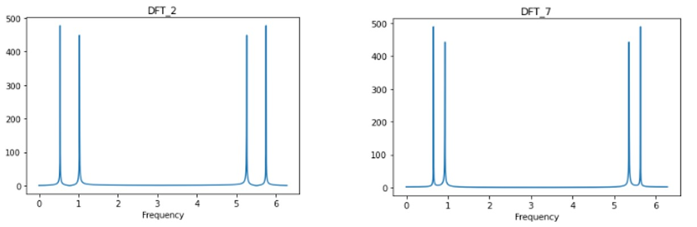

    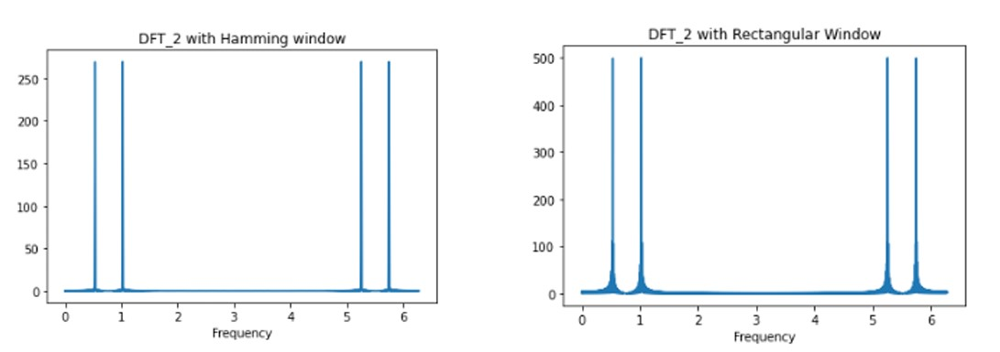

- **Observation:** The windowing in both cases (Rectangular and Hamming windows) is effective, yielding results close to the Discrete Fourier Transform (DFT) of 2. However:
  - The **Hamming Window** introduces less noise but reduces the peak amplitudes compared to the **Rectangular Window**.

#### **About DFT and Windows**
- **Discrete Fourier Transform (DFT):** Converts a discrete-time signal into its frequency components, providing a global frequency-domain representation.
- **Hamming and Rectangular Windows:**
  - **Hamming Window:** Smoothens edges, reducing spectral leakage but decreasing peak amplitude.
  - **Rectangular Window:** Directly truncates the signal, preserving peak values but introducing more noise.

### **1.5 Frequency List Creation**

We created the list $$\( k \)$$ in the form of a dictionary for better readability. This list was generated using a similar process to the previous question, applying the Hamming window and analyzing the sequence of digits $$\([0,1,2,3,4,5,6,7,8,9]\)$$.

- **Observation:** The frequencies deviate slightly from the theoretical definition of the sinusoids, indicating a relatively good approximation.

### **1.6 Digit Identification**

To identify the correct digit, we:
1. Used a helper function to extract frequency values for each digit.
2. Compared these frequencies with the previously created $$\( k \)$$ list and selected the pair with the closest match.

A subroutine `make_tone()` was used to generate the sequence 03118822, avoiding zeros in the signal length, and extracting necessary values for the analysis. The function `freq_creator()` returned the frequency values, which were then processed by `ttdecode()` to compare against the $$\( k \)$$ list.

### **1.7 Results for Signal Decoding**

Below are the results for analyzing `easySig` and `hardSig` using `ttdecode()`, confirming the effectiveness of the method for signal decoding.

    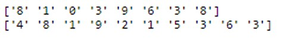

---

## **2. Advanced Signal Analysis**

### **2.1 Short-Time Fourier Transform (STFT)**

#### (a) Signal Function Definition
We defined our signal function using numpy and generated the following result.

    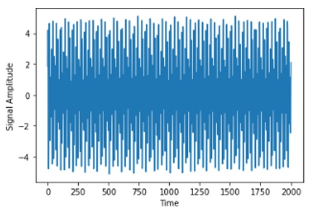

#### (b) STFT with a 0.04-second Window
By applying a Short-Time Fourier Transform (STFT) using a 0.04-second window and 50% overlap, the following observations were made:

    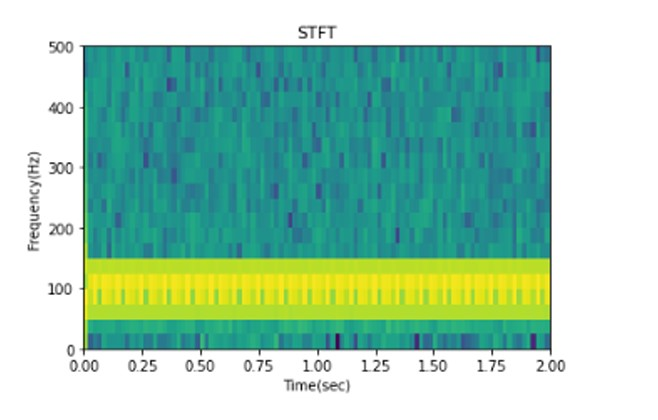

- **Observation:** With a small window size, the time-domain resolution is good, but the frequency-domain resolution is poor.

#### **About STFT**
- **Short-Time Fourier Transform (STFT):** Segments a signal using overlapping windows and applies the Fourier Transform to each segment, capturing time-varying frequency information. It is ideal for analyzing non-stationary signals, with a trade-off between time and frequency resolution.

#### (c) STFT with Larger Windows
We repeated the analysis using windows of 0.08 and 0.16 seconds.

    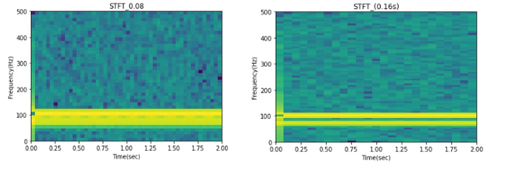

- **Observation:** Increasing the window size improves frequency-domain resolution but significantly reduces time-domain resolution. For a 0.16-second window, we achieve good frequency-domain approximation but poor temporal resolution.

#### (d, e) Continuous Wavelet Transform (CWT)
We performed a discretized Continuous Wavelet Transform (CWT) on the signal
.

    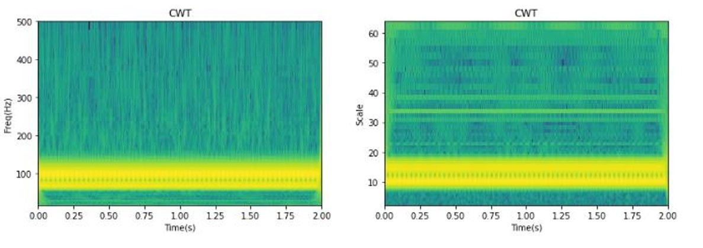

- **Observation:** The CWT provides a more balanced resolution in both time and frequency domains, as it is non-uniform and adapts to the signal characteristics.

#### **About CWT**
- **Continuous Wavelet Transform (CWT):** Analyzes a signal using scalable wavelets, offering adaptive resolution in time and frequency. It excels in detecting transient events and balancing both domains.

---

### **2.2 Signal Sampling and Analysis**

#### (a) Signal Sampling
We sampled the signal $$\( d(t) \)$$ as $$\( d[n] \)$$, modifying values at specific points to produce the corresponding graph.

    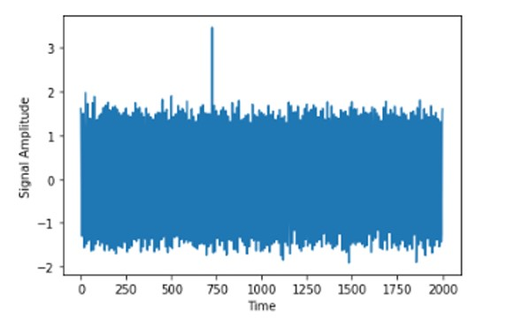

#### (b) STFT Analysis of Changes
We calculated the STFT and visualized it using `contour()`.

    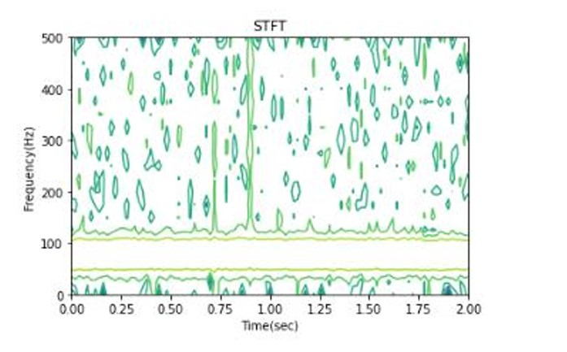

- **Observation:** Two sharp vertical lines in the frequency domain correspond to abrupt signal changes, making them easy to detect using STFT.

#### (c) Larger STFT Windows
Repeating the analysis with 0.08 and 0.16-second windows:

    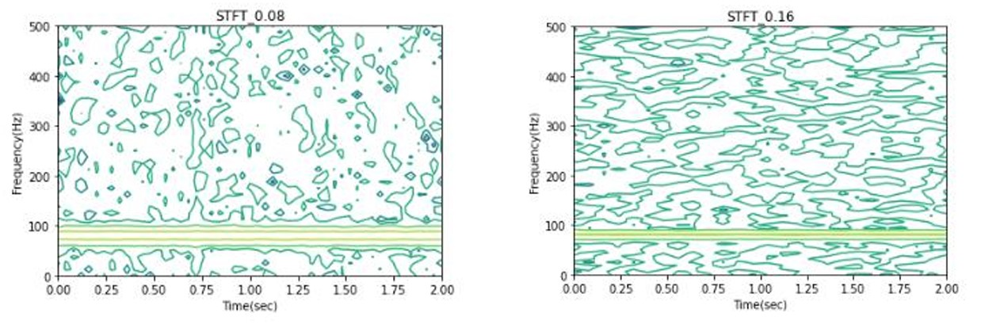

- **Observation:** Larger window sizes reduce the visibility of abrupt changes, demonstrating a trade-off between temporal resolution and frequency resolution.

#### (d) CWT Analysis
The discretized CWT revealed the following:

    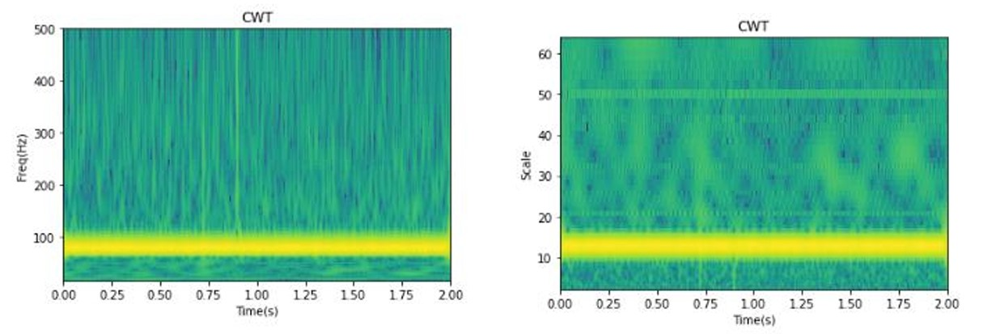

- **Observation:** Strong vertical curves in the frequency domain highlight abrupt changes, while weaker curves in the scale domain also align with these points.

---

## **3. Short-Time Energy and Zero-Crossing Rate (ZCR)**

### **3.1 Speech Signal Analysis**

We analyzed the signal `speech_utterance.wav` using short-time energy and zero-crossing rate (ZCR):

#### (a) Short-Time Energy and ZCR Graphs
For a 0.02-second Hamming window, we generated the following:

    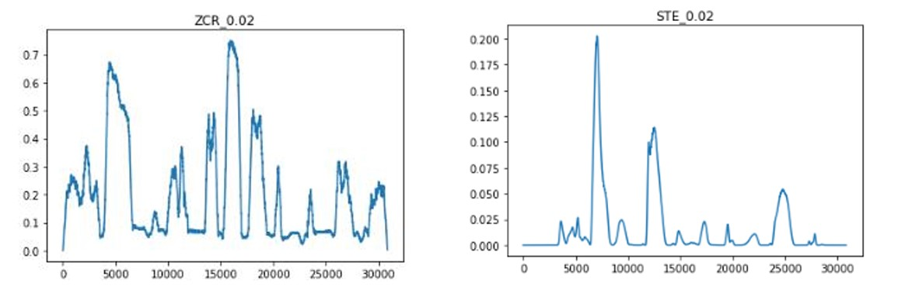

- **Observation:** Increasing the window size smooths the graphs and reduces noise. Short-time energy peaks correspond to voiced sounds, while ZCR peaks correspond to unvoiced sounds. The graphs are inversely related, aiding in voiced/unvoiced distinction.

#### **About Short-Time Energy and ZCR**
- **Short-Time Energy:** Computes the signal's energy within a window, identifying voiced sounds with higher energy peaks.
- **Zero-Crossing Rate (ZCR):** Measures the rate of sign changes in a signal, identifying unvoiced sounds with high ZCR values.

#### (b) Longer Window Analysis
Repeating with a 0.03-second window:

    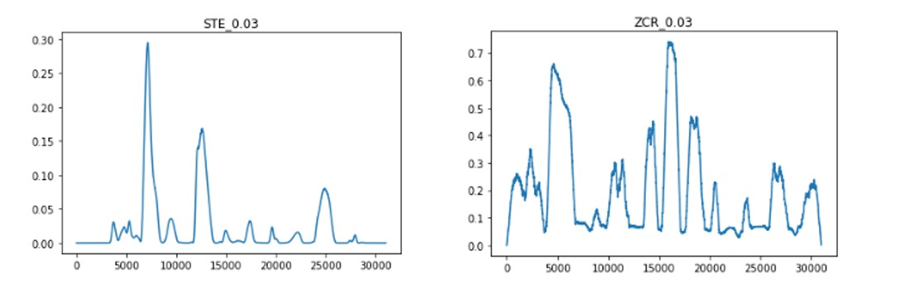

- **Observation:** The inverse relationship remains, confirming the robustness of the method.

### **3.2 Music Signal Analysis**

Repeating the process for `music.wav`, we observed:

    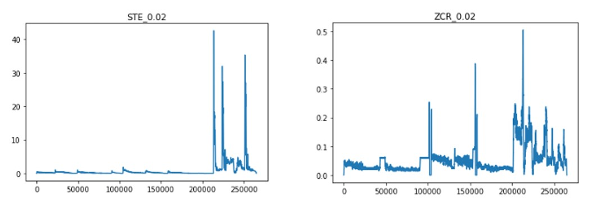

    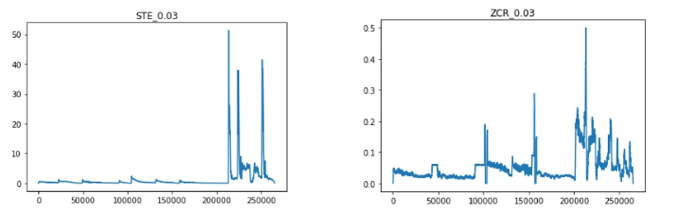

- **Observation:** Low-intensity instruments and synthetic notes exhibit minimal short-time energy but higher ZCR values. When vocals and stronger instruments enter, short-time energy increases sharply.

---

By leveraging these methods, we effectively analyzed signals across multiple domains, identifying their temporal and frequency characteristics.

## **4. Loading and Observing the Signal**

### **4.1 Signal Plot and Initial Observations**
We load the signal and plot it. Visually, we observe that each distinguishable pulse repeats every **0.5 seconds**.

    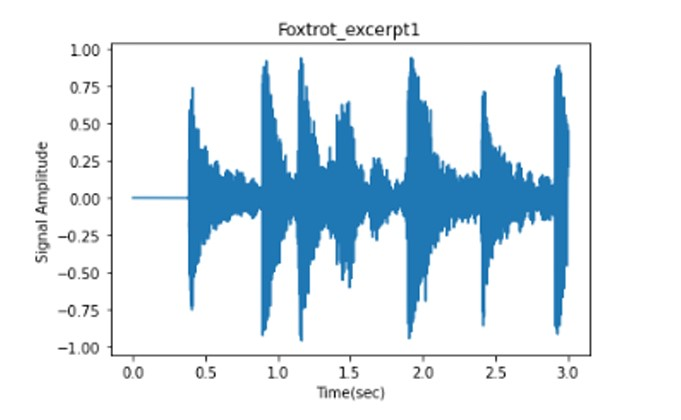

#### **About Signal Observation**
- Observing the signal allows for preliminary analysis of periodicity and pattern recognition, critical for further analysis.

---

## **5. Signal Envelope Analysis**

### **5.1 Envelope Function**
We create a function to extract the envelope of the input signal:
- **Parameters:** The function takes the level of analysis (`level`) and a coefficient (`α`).

#### **About Envelope Extraction**
- The envelope provides a smoothed representation of the signal's amplitude over time, aiding in periodicity analysis.

---

### **5.2 Results for Signals D2 and D4**
The extracted envelope results for signals **D2** and **D4** are as follows:

    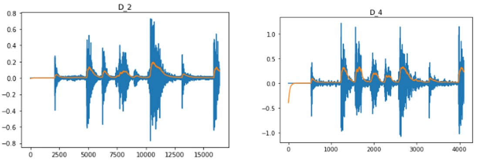

- **Observation:** Increasing the value of `α` to 0.005 reduces the envelope's smoothing, as the absolute signal contributes more prominently.

    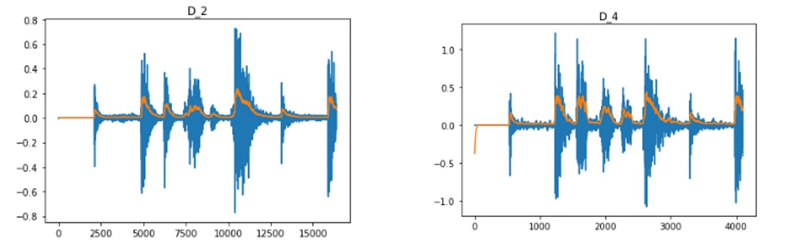

#### **About α's Impact**
- Smaller `α` values lead to better smoothing, while higher values highlight finer details of the signal's amplitude.

---

## **6. Signal Summation and Filtering**

### **6.1 Summation of Envelopes**
The summation of envelopes was performed as follows:
$$\[ S = \sum \text{Envelope Values} \]$$

    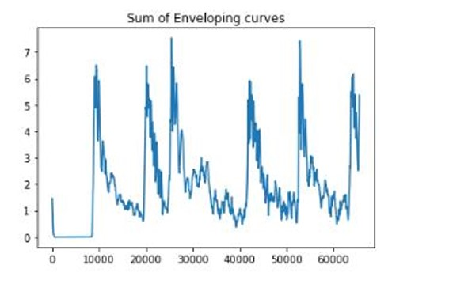

#### **About Summation**
- Summing envelopes helps capture the collective periodicity across multiple signals.

### **6.2 Gaussian Filtering**
We applied a Gaussian filter using `scipy.ndimage.gaussian_filter1d()` to smooth the autocorrelation graph of the sum.

    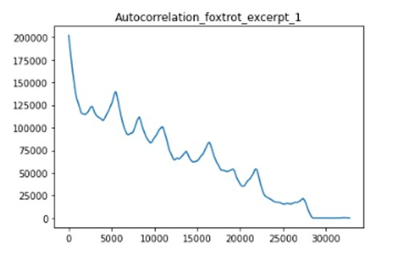

#### **About Gaussian Filtering**
- Gaussian filtering reduces noise, making periodic patterns more discernible in autocorrelation analysis.

---

## **7. Autocorrelation and Periodicity**

### **7.1 Signal Autocorrelation**
Analyzing the first signal, we observe:
- Autocorrelation starts at high values and gradually decays.
- It exhibits multiple local extrema, indicating periodic patterns at specific intervals.

#### **About Autocorrelation**
- Autocorrelation measures signal similarity over time, identifying periodic structures and their intervals.

---

### **7.2 BPM Analysis**
By analyzing peaks within a BPM range of 60–200, we estimate a BPM of approximately **121 BPM** for the first signal.

#### **About BPM Estimation**
- Peaks with the highest amplitude correspond to the dominant periodicity, helping deduce the BPM.

---

## **8. Signal Analysis for D2 and D4**

### **8.1 Observations for Second Signal**
For the second signal:

    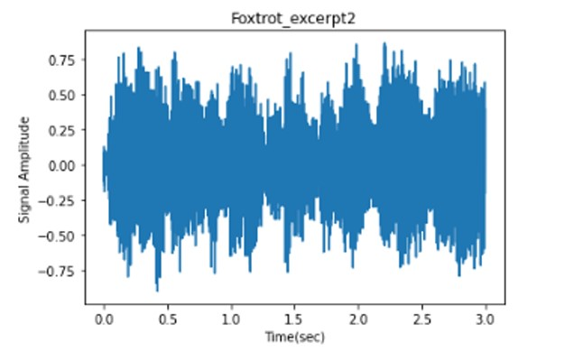

- Peaks are less regular, leading to less confidence in periodicity detection.
- A commonly observed interval is between **0.4–0.45 seconds**.

#### **Envelope Analysis**
- Envelopes and signals for **D2** and **D4** highlight periodic variations and their amplitudes.

    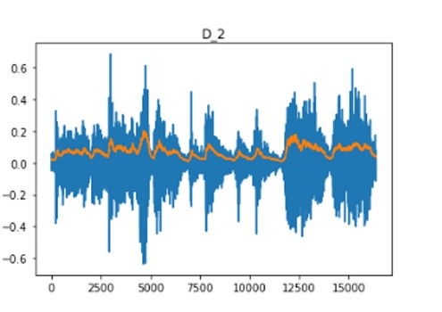
    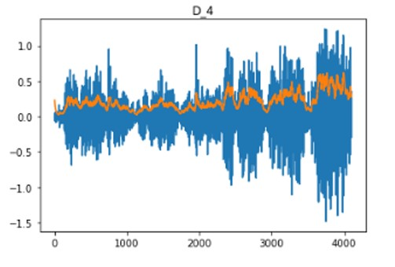

    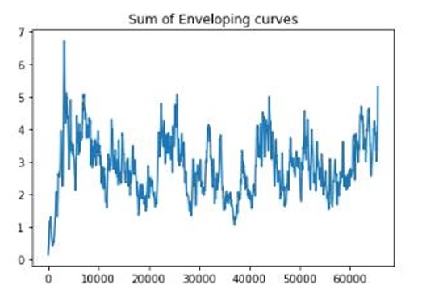

#### **About Regularity**
- Irregular peaks suggest a weaker or more complex periodic structure, complicating BPM determination.

### **8.2 BPM Estimation for Second Signal**
Filtering the autocorrelation reveals smoother patterns. The periodicity analysis indicates a BPM close to **149 BPM**.

    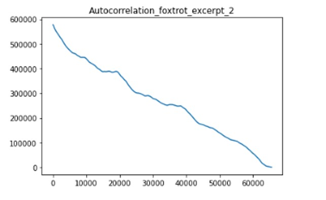

#### **Impact of Filtering**
- Smoothing highlights dominant periodic peaks, enhancing the reliability of BPM estimation.

---

## **9. Analysis of Third Signal**

### **9.1 Preprocessing**
We select the interval between the **first** and **fourth seconds** to avoid initial silence.

    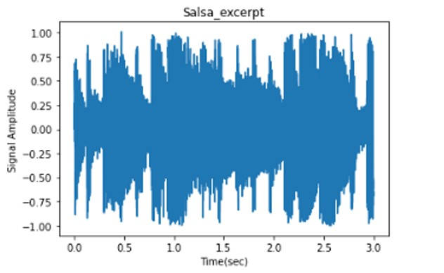

#### **About Preprocessing**
- Removing silent sections improves the clarity of periodic analysis.

### **9.2 Observations**
Peaks occur approximately every **0.3 seconds**, indicating a higher frequency of repetition.

#### **Envelope Analysis**
- Envelopes and signals for **D2** and **D4** provide consistent periodic indicators.

    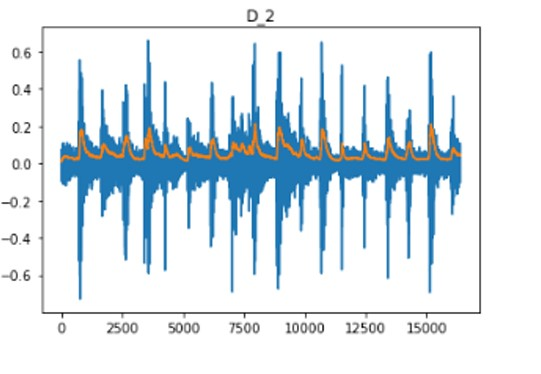
    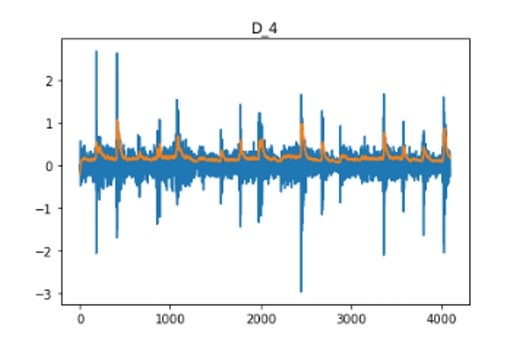

    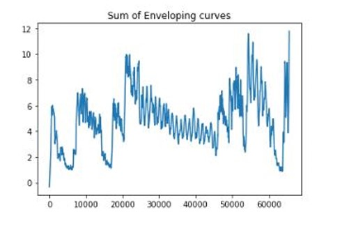

### **9.3 BPM Estimation**
The periodicity analysis reveals a BPM of approximately **191 BPM**.

    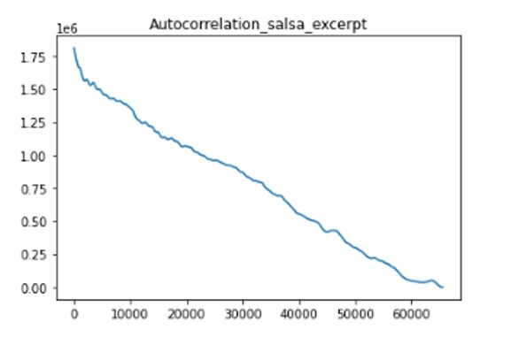

---

## **10. Comparing Musical Rhythms**

### **10.1 Insights from BPM**
Using BPM, we distinguish between musical styles:
- **Foxtrot Signals:** Medium BPM, reflecting moderate rhythmic complexity.
- **Salsa Signals:** High BPM, corresponding to fast, energetic dance rhythms.

#### **About BPM Analysis**
- BPM serves as a practical metric for classifying music styles based on rhythmic intensity and tempo.
